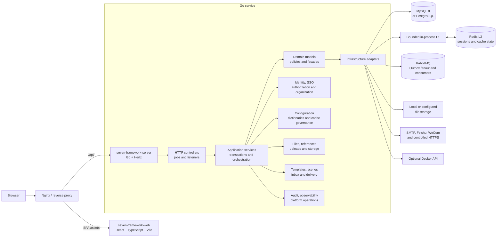

# Seven Framework

Seven Framework is an open-source administration and application foundation built with a Go service and a React Web application. It provides a production-oriented identity, authorization, configuration, file, notification, audit, and operations baseline through a domain-oriented architecture.

Repository: `github.com/CaixyPromise/seven-framework`

## Implemented capabilities

### Identity and account security

- First-run owner setup with guarded MySQL and PostgreSQL schema bootstrap.
- Password and Passkey login, TOTP verification, recovery codes, image captcha, email OTP, and reusable step-up challenge flows.
- OAuth 2.0/OIDC authorization server endpoints, client management, session and device management, token revocation, and logout-all operations.
- Configurable external-login providers and managed OIDC integration.
- Online-session visibility, forced logout, login-failure controls, and transactional session revocation after security-sensitive account changes.

### Organization and authorization

- Users, organizations, departments, posts, roles, menus, and permission resources.
- Atomic role-grant updates, custom data scopes, temporary permissions, and permission-aware menu delivery.
- Runtime authorization snapshots with L1 and Redis-backed L2 caching, transaction-bound invalidation, RabbitMQ fanout, and fail-closed source refresh when freshness cannot be established.
- Snowflake `BIGINT` identifiers across internal entities, preserved as decimal strings at JavaScript boundaries.

### Dynamic configuration and dictionaries

- Grouped configuration management with version checks, validation, exposure levels, audit history, and cache-aware client reads.
- Typed values for single-line and multiline text, integers, decimals, booleans, single/multi enums, dates, datetimes, durations, colors, controlled JSON, images, and files.
- Configuration assets backed by the existing file-reference lifecycle; upload alone does not grant or create a business binding.
- Dictionary types and values with scoped client contracts and governed multi-level cache invalidation.
- Runtime branding and feature availability delivered by API contracts instead of private deployment constants in the Web build.

### File and storage lifecycle

- Standard upload, instant upload, chunked upload, resume/abort flows, and direct-upload task completion.
- File metadata, reference inspection, access-level management, secure download tokens, and configurable storage strategies.
- Processing retries, reference-binding retries, orphan cleanup, unfinished-upload cleanup, storage health checks, and strategy draining.
- Configuration image/file assets reuse the same file service and reference model; no separate configuration-asset binding table is required.

### Notification center

- Versioned templates and scenes, strict variable validation, side-effect-free preview, immutable published revisions, and acceptance-time snapshots.
- In-app inbox, unread state, expiry, deep links, and realtime mailbox updates.
- Transactional Outbox, RabbitMQ relay/consumption, idempotent delivery records, retries, restart recovery, and provider-safe diagnostics.
- Mock and SMTP delivery, plus guarded Feishu application, WeCom application, Feishu/WeCom fixed Webhook, and controlled HTTPS connector drivers.
- External recipients remain business-call inputs; external delivery does not implicitly create an in-app message or platform-user mapping.

### Operations and platform modes

- Structured operation logs, operation-type metadata, export and retention cleanup, runtime-log querying/streaming, and online-user administration.
- Health and observability endpoints, tracing/metrics infrastructure, scheduled jobs, distributed locking, and cache-governance controls.
- Optional Docker container/image/Compose/registry operations with permission gates and runtime feature filtering.
- Local, Hub, and Node platform modes with dedicated control-plane and node-management boundaries. Hub, Node, Docker, RabbitMQ, and external providers remain configuration-gated.

## Architecture overview



The service enforces dependency direction with repository architecture tests. Business modules live under `internal/app`; entry points call their local application/facade contracts, application services orchestrate transactions, domain code owns business rules, and infrastructure implements persistence and provider boundaries. Cross-module integration uses facades instead of importing another module's application internals.

## Repository layout

```text
seven-framework-server/  Go API service, migrations, and tests
seven-framework-web/     React and Vite Web application
deploy/nginx/            Deployment template for Web and API routing
scripts/release/         Reproducible release-package assembly
docs/                    Architecture, configuration, migration, and deployment guides
```

The Web project is private package metadata and is not published to npm. Official release artifacts contain one `seven-framework-server` executable together with the built Web assets, database migrations, example configuration, Nginx template, checksums, and an SPDX SBOM.

## Prerequisites

- Go 1.25 or newer
- Node.js 20.19 or newer
- pnpm 10
- MySQL 8 or PostgreSQL 16 for persistent storage
- Redis and RabbitMQ only when the corresponding optional features are enabled

The public example configuration is intentionally safe-off. Setup, login, Redis, RabbitMQ, file processing, external providers, Docker administration, and federation capabilities become available only when their required configuration and dependencies are present.

## Source development

Create a complete local configuration without committing it. The command
generates owner-only local keys, enables setup/login/SSO and Redis, and never
overwrites an existing `.local` configuration:

```bash
scripts/dev/init-local.sh \
  --mysql-dsn 'user:password@tcp(127.0.0.1:3306)/seven_framework?parseTime=true'
```

PostgreSQL is also supported through `--postgres-dsn`. Pass
`--rabbitmq-url` only when local notification/outbox consumption is required.
The public example intentionally remains safe-off.

For manually managed configuration, set sensitive values through environment
variables. Viper maps configuration keys to uppercase underscore names; for example:

```bash
export DATASOURCE_MYSQL_ENABLED=true
export DATASOURCE_MYSQL_DSN='user:password@tcp(127.0.0.1:3306)/seven_framework?parseTime=true'
```

Start the API and Web development servers:

```bash
make -C seven-framework-server run-local
pnpm --dir seven-framework-web install --frozen-lockfile
pnpm --dir seven-framework-web dev
```

The development Web server listens on `127.0.0.1:5177` and proxies `/api` to `127.0.0.1:9277` by default. Override the development target with `VITE_DEV_API_TARGET`.

## Service commands

```text
seven-framework-server serve
seven-framework-server migrate <up|down|status|version|inspect|bootstrap|create|fix>
seven-framework-server version
```

`serve` is the default command. In release packages, resource lookup uses this precedence:

1. `--config-dir` and `--migrations-dir`;
2. `--home`;
3. `SEVEN_FRAMEWORK_HOME`;
4. the release root inferred from `bin/seven-framework-server`.

Missing configuration or migration directories cause startup to fail instead of falling back to the current working directory.

## Build and test

```bash
make web-install
make check
make release VERSION=0.1.0
```

The repository checks include Go tests and race targets, Web type/lint/build checks, DDD import-boundary enforcement, migration-history validation for both SQL dialects, and database contracts that prohibit foreign keys and unbounded text identifier columns.

See [configuration](docs/configuration.md), [database migration](docs/migration.md), [deployment](docs/deployment.md), and [architecture](docs/architecture.md) for the operational contract.

## License

Copyright CaixyPromise. Licensed under the [Apache License 2.0](LICENSE).
